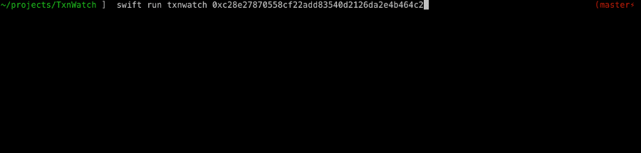

# txnwatch [](https://blockchair.com/bitcoin/address/1CDF8xDX33tdkEyUcHL22DBTDEmq4ukMPp) [](https://blockchair.com/ethereum/address/0xde6458b369ebadba2b515ca0dd4a4d978ad2f93a)  <a href="https://www.buymeacoffee.com/pj4533" target="_blank"></a>



```
OVERVIEW: Realtime ERC20 Token Transactions

USAGE: txnwatch <query> [--include-transaction]

ARGUMENTS:
  <query>                 ERC20 address/symbol/name

OPTIONS:
  -i, --include-transaction
                          Include transaction hash in output
  -h, --help              Show help information.
  ```

TxnWatch connects via websocket to Infura and subscribes to the logs of a given token. When a transaction comes through, a call is made to get the transaction and the transaction receipt. Data is parsed using the [Web3.swift](https://github.com/Boilertalk/Web3.swift) library.

### Building Notes

As a quick hack for handling secrets (like API keys), I just put them in a file that is excluded from git. 
1. Under the `Sources/TxnWatch` folder, create a file called `Secrets.swift`
2. In that file put this:
```
struct Secrets {
  let infuraProjectId = "<Your Infura Project ID Key>"
}
```
3. Then build normally

### Helpful Links

https://etid.wtd.ru

https://etherscan.io

https://www.pauric.blog/How-to-Query-and-Monitor-Ethereum-Contract-Events-with-Web3/


### Developer Commands

`swift build` Builds app to the `.build` folder

`swift build -c release` Build a release version

`swift package generate-xcodeproj` Generates an xcode project file

